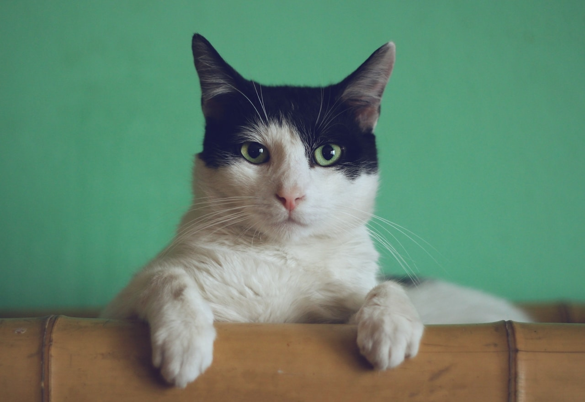
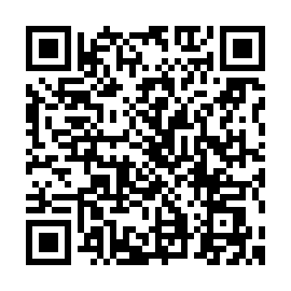

# 天氣貓咪 (=ↀωↀ=)



## 加入聊天機器人



## Using

### 

## Requirements

- AWS CLI already configured with Administrator permission
- Docker
- Golang
- SAM CLI
- Line Message API channel registered
- Create env.go file in "weather-cat" folder (cuz something went wrong when I use godotenv :cry: )

```go
package main

var env = struct {
	OWM_API_KEY       string
	LINE_ACCESS_TOKEN string
	LINE_SCRET_TOKEN  string
}{
	OWM_API_KEY:       "xxx",
	LINE_ACCESS_TOKEN: "xxx",
	LINE_SCRET_TOKEN:  "xxx",
}
```

### Local development

```bash
sam build && sam local start-api
```

### Deploy

```
sam deploy --guided
```

## References

1. [SAM CLI](https://docs.aws.amazon.com/serverless-application-model/latest/developerguide/serverless-sam-cli-command-reference.html)

1. [Line Message API](https://developers.line.biz/en/services/messaging-api/)

1. [Open Weather Map API](https://openweathermap.org/api)

1. [Unsplash API](https://unsplash.com/developers)

1. Avatar Photo by [Manja Vitolic](https://unsplash.com/@madhatterzone?utm_source=unsplash&utm_medium=referral&utm_content=creditCopyText) on [Unsplash](https://unsplash.com/s/photos/cat?utm_source=unsplash&utm_medium=referral&utm_content=creditCopyText")

1. [Cat Emoji](http://tw.emoticonfun.com/cat/)
